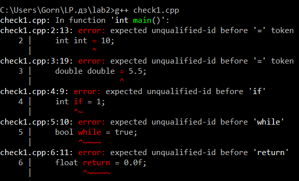
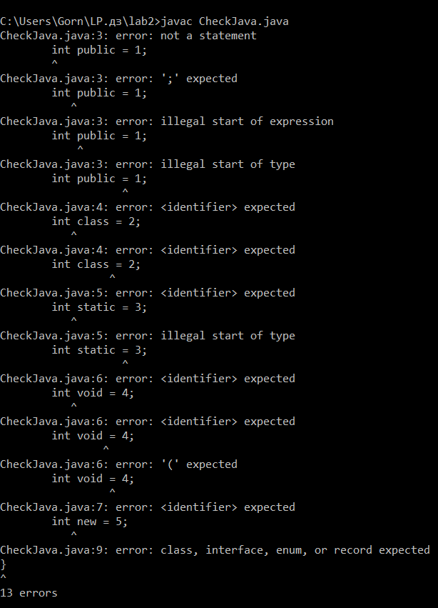
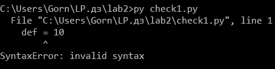
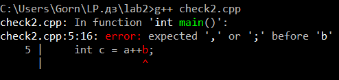
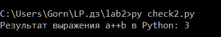
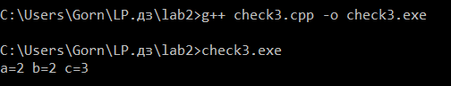
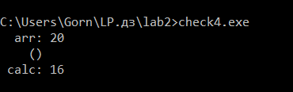
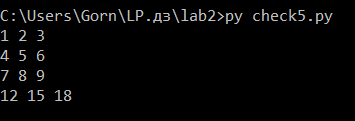
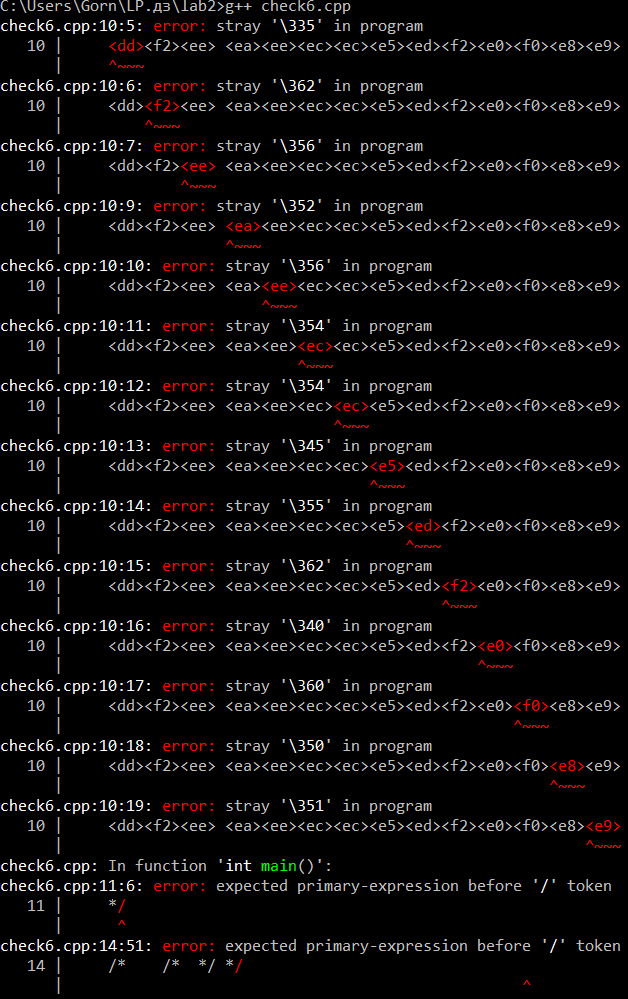

# ЛАБОРАТОРНАЯ РАБОТА: ЛЕКСИЧЕСКИЙ И СИНТАКСИЧЕСКИЙ АНАЛИЗ

## Задание 1. Ключевые слова в языках программирования

Для проведения практического теста были выбраны по 5 ключевых слов для каждого из трёх языков программирования:
- C++: int, double, if, while, return
- Java: public, class, static, void, new
- Python: def, import, from, global, lambda

### Ход выполнения и результаты тестирования:

1. **Тестирование компилятора C++:**
Создали файл `check1.cpp` в Far Manager и принудительно попытались использовать зарезервированные ключевые слова в качестве имён переменных. Запустили компиляцию через команду `g++ check1.cpp`. Компилятор g++ ожидаемо зафиксировал фатальные ошибки разбора структуры синтаксиса (error: expected unqualified-id) и заблокировал сборку программы.

2. **Тестирование компилятора Java:**
Создали файл `CheckJava.java` в Far Manager, обернули 5 ключевых слов в метод main в качестве идентификаторов и запустили сборку командой `javac CheckJava.java`. Парсер компилятора javac сошёл с ума от такой структуры кода и выдал в консоль лог из синтаксических ошибок (вида "not a statement" и "expected").

3. **Тестирование интерпретатора Python:**
Создали файл `check1.py` в Far Manager, где попытались присвоить значения зарезервированным лексемам Python. Запустили скрипт в консоли через команду `py check1.py`. Интерпретатор мгновенно упал на этапе предварительного парсинга кода, выдав ошибку "SyntaxError: invalid syntax" на первой же строчке.

### Итоговый вывод по Заданию 1:
Создавать переменные с именами ключевых слов НЕЛЬЗЯ ни в одном языке программирования. Ключевые слова имеют строго фиксированное значение в грамматике. Лексические и синтаксические парсеры трансляторов ожидают увидеть их только в составе предопределенных управляющих конструкций (объявление функций, классов, циклов, условий или типов данных). Попытка использовать их как имена переменных полностью ломает дерево синтаксического разбора, что наглядно доказано ошибками на скриншотах выше.

---

## Задание 2. Анализ синтаксической конструкции c = a++b

Конструкция была протестирована в средах C++ (файл check2.cpp) и Python (файл check2.py) для фиксации последовательности токенов и логики работы лексических и синтаксических анализаторов.

### 1. Лексический анализ (Разбиение программ на токены):

**Программа на C++:**

| Исходный текст | Токен (Лексема) | Категория токена |
| :--- | :--- | :--- |
| `int` | `int` | Ключевое слово (Keyword) |
| `a` | `a` | Идентификатор (Identifier) |
| `=` | `=` | Оператор присваивания (Operator) |
| `1` | `1` | Литерал (Literal) |
| `,` | `,` | Разделитель (Punctuation) |
| `b` | `b` | Идентификатор (Identifier) |
| `=` | `=` | Оператор присваивания (Operator) |
| `2` | `2` | Литерал (Literal) |
| `;` | `;` | Разделитель (Punctuation) |
| `int` | `int` | Ключевое слово (Keyword) |
| `c` | `c` | Идентификатор (Identifier) |
| `=` | `=` | Оператор присваивания (Operator) |
| `a` | `a` | Идентификатор (Identifier) |
| `++` | `++` | Оператор инкремента (Operator) |
| `b` | `b` | Идентификатор (Identifier) |
| `;` | `;` | Разделитель (Punctuation) |

*Полная последовательность токенов C++:* `[int] [a] [=] [,] [b] [=] [;] [int] [c] [=] [a] [++] [b] [;]`

---

**Программа на Python:**

| Исходный текст | Токен (Лексема) | Категория токена |
| :--- | :--- | :--- |
| `a` | `a` | Идентификатор (Identifier) |
| `=` | `=` | Оператор присваивания (Operator) |
| `1` | `1` | Литерал (Literal) |
| `\n` | `\n` | Конец строки (Newline) |
| `b` | `b` | Идентификатор (Identifier) |
| `=` | `=` | Оператор присваивания (Operator) |
| `2` | `2` | Литерал (Literal) |
| `\n` | `\n` | Конец строки (Newline) |
| `c` | `c` | Идентификатор (Identifier) |
| `=` | `=` | Operator присваивания (Operator) |
| `a` | `a` | Идентификатор (Identifier) |
| `++` | `+`, `+` | Два оператора унарного плюса (Unary operators) |
| `b` | `b` | Идентификатор (Identifier) |
| `\n` | `\n` | Конец строки (Newline) |

*Полная последовательность токенов Python:* `[a] [=] [\n] [b] [=] [\n] [c] [=] [a] [+] [+] [b] [\n]`

---

### 2. Ход выполнения и результаты тестирования:

1. **Тестирование компилятора C++:**
Создали файл `check2.cpp` и попытались скомпилировать выражение `int c = a++b;` с помощью команды `g++ check2.cpp`. Лексический анализатор C++ руководствуется правилом "максимального поглощения" (maximal munch) — он собирает максимально длинный возможный токен из идущих подряд символов. Из двух плюсов он сформировал единый токен оператора постфиксного инкремента [++], превратив код в выражение `c = (a++) b;`. Синтаксический парсер выдал фатальную ошибку сборки, так как между инкрементом переменной 'a' и идентификатором 'b' отсутствует бинарный оператор.

2. **Тестирование интерпретатора Python:**
Создали файл `check2.py` с аналогичной конструкцией и запустили его командой `py check2.py`. Поскольку в спецификации синтаксиса Python оператор инкремента [++] отсутствует в принципе, лексический парсер разбил два знака плюс на два независимых токена унарного плюса [+]. Выражение успешно распозналось синтаксическим анализатором как стандартное сложение переменной 'a' с положительным значением переменной 'b': `c = a + (+b)`. Программа отработала корректно и вывела результат 3.

## Задание 3. Анализ синтаксической конструкции int c = a+++b;

Конструкция была протестирована в среде C++ путём создания и выполнения изолированного файла check3.cpp для фиксации последовательности токенов и итоговых значений переменных.

### 1. Лексический анализ (Разбиение программы на токены):

| Исходный текст | Токен (Лексема) | Категория токена |
| :--- | :--- | :--- |
| `int` | `int` | Ключевое слово (Keyword) |
| `a` | `a` | Идентификатор (Identifier) |
| `=` | `=` | Оператор присваивания (Operator) |
| `1` | `1` | Литерал (Literal) |
| `,` | `,` | Разделитель (Punctuation) |
| `b` | `b` | Идентификатор (Identifier) |
| `=` | `=` | Оператор присваивания (Operator) |
| `2` | `2` | Литерал (Literal) |
| `;` | `;` | Разделитель (Punctuation) |
| `int` | `int` | Ключевое слово (Keyword) |
| `c` | `c` | Идентификатор (Identifier) |
| `=` | `=` | Оператор присваивания (Operator) |
| `a` | `a` | Идентификатор (Identifier) |
| `++` | `++` | Оператор постфиксного инкремента (Operator) |
| `+` | `+` | Оператор бинарного сложения (Operator) |
| `b` | `b` | Идентификатор (Identifier) |
| `;` | `;` | Разделитель (Punctuation) |

*Полная последовательность токенов программы:* `[int] [a] [=] [,] [b] [=] [;] [int] [c] [=] [a] [++] [+] [b] [;]`

---

### 2. Ход выполнения, значения переменных и результаты тестирования:

1. **Тестирование программы в консоли:**
Создали файл `check3.cpp`, успешно скомпилировали его командой `g++ check3.cpp -o check3.exe` и запустили исполняемый файл. Программа выполнилась корректно без синтаксических ошибок.

2. **Объяснение работы и итоговые значения переменных:**
   - **Итоговые значения:** `a = 2`, `b = 2`, `c = 3`.
   - **Причина и логика работы:** Лексический анализатор C++ руководствуется правилом "максимального поглощения" (maximal munch). При чтении трёх плюсов подряд он группирует первые два символа в максимально длинный возможный токен — оператор постфиксного инкремента [++], а оставшийся один плюс распознаётся как оператор бинарного сложения [+]. Синтаксический парсер видит выражение как `c = (a++) + b;`. 
   Так как инкремент переменной 'a' является постфиксным, в самом выражении сложения участвует текущее (старое) значение переменной 'a', которое равно 1. Соответственно, `c = 1 + 2 = 3`. И только после завершения вычисления всего выражения значение переменной 'a' увеличивается на 1 в памяти и становится равным 2. Переменная 'b' своего значения в ходе операции не меняет (остаётся равной 2).

3. **Влияние пробелов на разбиение токенов:**
   - **Ответ:** ДА, изменить разбиение программы на токены с помощью пробелов можно. Для лексического анализатора пробелы служат явными жёсткими разделителями.
   - **Пример изменения:** Если расставить пробелы вручную в виде конструкции `int c = a + ++b;`, то лексер сформирует совершенно другую последовательность токенов: `[a] [+] [++] [b]`. Синтаксический анализатор интерпретирует это как сложение переменной 'a' с префиксным инкрементом переменной 'b' (то есть `c = a + (++b)`). В таком сценарии переменная 'b' сначала увеличится в памяти до 3, а затем прибавится к 'a' (1). Переменные примут значения: `a = 1`, `b = 3`, `c = 4`.

## Задание 4. Анализ круглых () и квадратных [] скобок в роли операторов

Различные синтаксические роли скобок были протестированы и продемонстрированы на практике в среде C++ с помощью файла check4.cpp.

### Ход выполнения и результаты тестирования:

1. **Тестирование демонстрационной программы:**
Создали файл `check4.cpp`, успешно скомпилировали его командой `g++ check4.cpp -o check4.exe` и запустили исполняемый файл в консоли Far Manager для проверки логики работы операторов скобок.

2. **Теоретический разбор и примеры фрагментов программ:**

- **Квадратные скобки []**
  * **ЯВЛЯЮТСЯ оператором:** Когда используются как *оператор индексации* (subscript operator) для доступа к элементу массива, вектора или умного указателя по смещению. Лексический анализатор выделяет токен оператора, а синтаксический строит узел обращения к ячейке памяти. *Пример в check4.cpp:* `int val = arr[1];`
  * **НЕ ЯВЛЯЮТСЯ оператором:** Когда являются частью объявления типа данных при инициализации статического массива (задают размерность выделяемой памяти в синтаксисе). Также не являются оператором при создании литерала списка (list comprehension) в Python. *Пример в check4.cpp:* `int arr[] = {10, 20, 30};`

- **Круглые скобки ()**
  * **ЯВЛЯЮТСЯ оператором:** 
    1. Когда выступают как *оператор вызова функции* (function call operator), передавая управление и аргументы блоку кода. *Пример в check4.cpp:* `my_func();`
    2. Когда выполняют роль *оператора явного приведения типов* (explicit cast operator) в стиле языка C. *Пример в check4.cpp:* `int int_pi = (int)pi;`
  * **НЕ ЯВЛЯЮТСЯ оператором:** Когда используются как группирующие символы в арифметических или логических выражениях для принудительного изменения стандартного приоритета выполнения операций, заложенного в грамматике парсера. В этом случае они служат лишь подсказкой для синтаксического анализатора при построении дерева. Также они не являются оператором при инициализации литерала кортежа (tuple) в Python. *Пример в check4.cpp:* `int calc = (5 + 3) * 2;`

## Задание 5. Анализ комплексного выражения на языке Python

Конструкция протестирована в файле check5.py. Программа выполняет поэлементное сложение (векторную сумму) трёх введённых числовых последовательностей.

### 1. Ход выполнения и результаты тестирования:

Создали файл `check5.py`, запустили его командой `py check5.py` и передали на вход три строки с матричными данными. Программа успешно выполнила расчёты и вывела результат в консоль.

### 2. Лексический анализ выражения:

- **Ключевые слова (Keywords):** `for`, `in`
- **Литералы (Literals):** `1`, `2`, `3` (целочисленные литералы внутри кортежа)
- **Операторы (Operators):** `*` (оператор распаковки аргументов последовательности, использован дважды)
- **Идентификаторы (Identifiers):** `print`, `map`, `sum`, `zip`, `int`, `input`, `split`, `i`

### 3. Разделение идентификаторов по ролям:
- **Задают переменные:** `i` (переменная цикла внутри генератора списка)
- **Имена функций и методов:** `print`, `map`, `sum`, `zip`, `int`, `input`, `split`

### 4. Вызываемые функции и их параметры:
- `input()` — вызывается без параметров. Считывает строку текста из стандартного потока ввода.
- `split()` — метод строки, вызывается без параметров. Разбивает считанную строку на список подстрок по пробелам.
- `int` — передается как объект-функция в качестве первого параметра в `map()`. Преобразует строковое значение в целое число.
- `map(int, input().split())` — параметры: функция `int` и список строк от `split()`. Возвращает итератор с числами.
- `zip(*...)` — принимает распакованный список, состоящий из 3 объектов `map`. Группирует элементы, стоящие на одинаковых индексных позициях.
- `sum` — передается как объект-функция в качестве первого параметра во внешний `map()`. Вычисляет сумму элементов переданной последовательности.
- `map(sum, zip(...))` — параметры: функция `sum` и результат группировки от `zip()`.
- `print(*...)` — принимает распакованные элементы итогового `map` и выводит их в консоль через пробел.

### 5. Алгоритм работы программы:
1. Конструкция спискового включения `[... for i in (1, 2, 3)]` выполняет итерацию три раза, поочередно вызывая цепочку `input().split()` и приводя элементы к числам через `map(int, ...)`. На выходе формируется список из трёх последовательностей чисел (матрица 3x3).
2. Оператор `*` перед списком распаковывает его, передавая эти три последовательности как отдельные аргументы в функцию `zip()`.
3. Функция `zip()` транспонирует данные: собирает вместе все первые элементы строк, все вторые элементы и все третьи элементы.
4. Внешний `map(sum, ...)` берет каждую сгруппированную по столбцам группу чисел и находит её сумму. Для ввода `1 2 3`, `4 5 6`, `7 8 9` столбцы складываются как: (1+4+7=12), (2+5+8=15), (3+6+9=18).
5. Функция `print(*...)` распаковывает получившийся результат и выводит суммы векторов `12 15 18` на экран.

## Задание 6. Способы записи и синтаксический анализ комментариев в C++

В языке C++ существует два стандартных способа записи комментариев:
1. Однострочные комментарии — начинаются с маркера `//` и действуют до конца текущей физической строки.
2. Многострочные (блочные) комментарии — заключаются между маркерами `/*` (начало) и `*/` (конец).

Для проверки синтаксиса примеров со слайда был создан файл check6.cpp. При попытке его сборки компилятор зафиксировал фатальные ошибки трансляции.

### Ход выполнения и результаты тестирования:

Попытались скомпилировать проверочный файл командой `g++ check6.cpp`. Компилятор g++ прервал трансляцию и выдал лог синтаксических ошибок, вызванных некорректным использованием вложенности и строковых переносов в комментариях.

### Подробный разбор синтаксической верности примеров:

1. `cout << "Hello /* Это комментарий */ world";`
   - **Статус:** Синтаксически ВЕРЕН.
   - **Как работает:** Символы `/*` и `*/` находятся внутри двойных кавычек, обозначающих строковый литерал. Лексический анализатор C++ обрабатывает их как обычные текстовые символы внутри строки, а не как управляющие маркеры разметки кода.

2. `// /* \n Это комментарий \n */`
   - **Статус:** Синтаксически НЕВЕРЕН (вызывает ошибку).
   - **Почему:** Строка начинается с маркера `//`, из-за чего лексер отбрасывает всю первую строку целиком (включая открывающий маркер `/*`). На следующей строке текст `Это комментарий` воспринимается компилятором как исходный код на C++, что порождает ошибку парсинга.

3. `/* Я комментирую программы /* комментарий */ */`
   - **Статус:** Синтаксически НЕВЕРЕН (вызывает ошибку).
   - **Почему:** Согласно стандарту C++, блочные многострочные комментарии НЕ могут быть вложенными. Первый встретившийся закрывающий маркер `*/` (после слова "комментарий") завершает действие всего блочного комментария. Оставшийся в самом конце хвост `*/` оказывается изолированным элементом вне комментария, что приводит к синтаксическому сбою.

4. `// Я комментирую программы /* комментарий */`
   - **Статус:** Синтаксически ВЕРЕН.
   - **Как работает:** Маркер однострочного комментария `//` стоит в самом начале строки. Лексер полностью игнорирует абсолютно все символы до конца этой строки, включая находящиеся там знаки `/*` и `*/`.

5. `/* Я комментирую свои программы \n // Это комментарий до конца строки */ \n */`
   - **Статус:** Синтаксически НЕВЕРЕН (вызывает ошибку).
   - **Почему:** Первый маркер `/*` открывает блок. Маркер `//` на второй строке игнорируется, так как находится внутри блока. Первый встреченный маркер `*/` на конце второй строки успешно закрывает весь блочный комментарий. Идущий на третьей строке одиночный знак `*/` оказывается лишним и ломает компиляцию.
