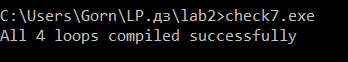
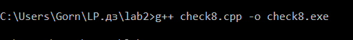

# Отчёт по лабораторной работе: Лексический и синтаксический анализ

## Задание 1. Ключевые слова

Для этой проверки я выбрал по 5 ключевых слов в каждом языке:
* C++: int, double, if, while, return
* Java: public, class, static, void, new
* Python: def, import, from, global, lambda

Я проверил, можно ли создать переменные с такими именами. Проверка показала, что это запрещено правилами всех трёх языков. Эти слова зарезервированы в самих языках для создания функций, циклов, условий и типов данных. Если попытаться назвать ими переменную, программа просто не поймет структуру кода и выдаст синтаксическую ошибку.

### Как проходило тестирование и что получилось:

1. Проверка в C++:
Я создал файл check1.cpp и попытался объявить там переменные с именами ключевых слов. При попытке скомпилировать его через команду g++ check1.cpp компилятор выдал ошибку синтаксиса и остановил сборку.

2. Проверка в Java:
Я написал код в файле CheckJava.java, где использовал ключевые слова как имена переменных внутри метода main. Сборка через команду javac CheckJava.java не прошла, компилятор выдал большой список ошибок разбора кода.

3. Проверка в Python:
Я сделал скрипт check1.py с попыткой присвоить значения этим словам. Запуск через команду py check1.py сразу прервался с ошибкой SyntaxError на первой же строчке кода.

### Вывод:
Тест на практике подтвердил, что ключевые слова нельзя использовать для создания своих переменных. Это базовое правило, и если его нарушить, программа не скомпилируется и не запустится.

---

## Задание 2. Выражение c = a++b

Я проверил, как эту строчку разбирают трансляторы в C++ (файл check2.cpp) и в Python (файл check2.py), и на какие отдельные элементы (токены) они делят этот текст.

* Последовательность токенов в C++: [int] [a] [=] [,] [b] [=] [;] [int] [c] [=] [a] [++] [b] [;]
* Последовательность токенов в Python: [a] [=] [\n] [b] [=] [\n] [c] [=] [a] [+] [+] [b] [\n]

### Как проходило тестирование и что получилось:

1. Проверка в C++:
При попытке скомпилировать файл через g++ check2.cpp вылетела ошибка. В C++ анализатор всегда пытается забрать максимально длинную операцию из идущих подряд символов. Поэтому он объединил два плюса в один токен инкремента [++]. Из-за этого выражение превратилось в синтаксически неверную конструкцию c = (a++) b. Компилятор не смог собрать код, так как между a++ и переменной b нет знака математической операции.

2. Проверка в Python:
Я запустил скрипт через py check2.py. Программа успешно выполнилась и вывела результат 3. В языке Python операции ++ не существует, поэтому анализатор воспринял два знака плюс как два отдельных унарных плюса перед переменной b. В итоге выражение посчиталось как обычное сложение: c = a + (+b).

---

## Задание 3. Выражение int c = a+++b;

Я написал проверочную программу в файле check3.cpp, скомпилировал её через g++ и запустил в консоли Far Manager.

* Последовательность токенов: [int] [a] [=] [,] [b] [=] [;] [int] [c] [=] [a] [++] [+] [b] [;]

### Как проходило тестирование и что получилось:

Программа успешно скомпилировалась без каких-либо ошибок. При запуске код выдал итоговые значения переменных: a = 2, b = 2, c = 3.

### Объяснение результатов:
Анализатор кода забрал первые два плюса под оператор инкремента [++], а третий плюс определил как обычное сложение. В итоге получилось выражение c = (a++) + b. 
Так как здесь используется постфиксный инкремент, для сложения берётся текущее значение переменной a (то есть 1). Получается c = 1 + 2 = 3. И только после того, как всё выражение посчиталось, переменная a увеличилась в памяти на единицу и стала равна 2. Переменная b при этом не изменилась.

Если бы я расставил пробелы по-другому, например `a + ++b`, то анализатор разбил бы код иначе (как сложение и префиксный инкремент b). В таком случае переменная b сначала увеличилась бы до 3, а результат c стал бы равен 4.

---

## Задание 4. Скобки () и []

Я написал простой пример в файле check4.cpp, чтобы проверить, в каких случаях круглые и квадратные скобки работают как операторы, а в каких — выступают просто как часть синтаксиса.

### Как проходило тестирование и что получилось:

Я скомпилировал проверочный файл и запустил его. Программа выполнилась без ошибок и вывела результаты работы на экран.

### Разбор работы скобок:

* Квадратные скобки `[]`: Работают как оператор, когда мы обращаемся к элементу массива по его индексу (например, `arr`). Но когда мы только объявляем статический массив в коде (`int arr[] = {10, 20, 30};`), эти скобки оператором не являются — это просто синтаксическое описание типа для выделения памяти.
* Круглые скобки `()`: Работают как оператор в двух случаях — при вызове функции (`my_func()`) или при явном преобразовании типов данных (`(int)pi`). В то же время, если использовать круглые скобки в обычных математических выражениях для изменения стандартного приоритета действий (например, `(5 + 3) * 2`), оператором они не считаются, а служат лишь средством группировки.

---

## Задание 5. Разбор строки на Python

Я написал и запустил скрипт check5.py с комплексным выражением: `print(*map(sum, zip(*[map(int, input().split()) for i in (1, 2, 3)])))`

### Как проходило тестирование и что получилось:

Я запустил этот скрипт в консоли и по очереди ввел три строки с числами через пробел. Программа успешно обработала ввод и выдала итоговый результат.

### Разбор элементов строки:
* Ключевые слова: for, in
* Литералы: 1, 2, 3
* Операторы: * (используется для распаковки списков и аргументов)
* Переменные: i (счетчик цикла внутри генератора)
* Имена встроенных функций и методов: print, map, sum, zip, int, input, split

### Как работает этот код:
Программа трижды ожидает ввод строки чисел от пользователя. Каждую введенную строку метод split() разбивает по пробелам на отдельные элементы, а map(int, ...) преобразует их в обычные целые числа. В результате формируется список из трех последовательностей (матрица чисел). 

Затем функция zip(*...) «переворачивает» эту матрицу, собирая в отдельные группы все первые элементы строк, все вторые и все третьи (группирует данные по столбцам). Внешняя функция map(sum, ...) находит сумму чисел в каждом получившемся столбце, а print(*...) распаковывает этот результат и выводит итоговые значения через пробел. По сути, код выполняет поэлементное векторное сложение трех числовых массивов.

---

## Задание 6. Комментарии в C++

Я проверил разные варианты записи однострочных и многострочных комментариев, собрав их все в один проверочный файл check6.cpp.

### Как проходило тестирование и что получилось:

При попытке скомпилировать файл через команду g++ check6.cpp компилятор выдал ошибки синтаксиса и прервал сборку. Это произошло из-за неправильной вложенности знаков комментариев.

### Разбор примеров:
1. `cout << "Hello /* комментарий */ world";` — Ошибок нет. Знаки стоят внутри двойных кавычек текстовой строки, поэтому компилятор воспринимает их как обычный текст, а не как начало комментария.
2. `// /* \n Это комментарий \n */` — Ошибка. Знак // в самом начале закомментировал всю первую строчку вместе с открывающим знаком /*. На следующей строке текст "Это комментарий" остался открытым, компилятор посчитал его за код и выдал ошибку.
3. `/* текст /* комментарий */ */` — Ошибка. В языке C++ нельзя делать вложенные многострочные комментарии. Самый первый встреченный знак */ закрывает весь комментарий, а последний хвост */ в конце строки остаётся лишним.
4. `// текст /* комментарий */` — Ошибок нет. Однострочный комментарий // в начале строки заставляет компилятор полностью проигнорировать абсолютно всё, что написано до конца этой строчки.
5. `/* текст // текст */ \n */` — Ошибка. Знак // внутри многострочного блока никак не влияет на разбор. Первый маркер */ успешно закрывает большой комментарий, а одинокий маркер */ на новой строке ломает компиляцию.

---

## Задание 7. Правила циклов в стандарте C++

Я проверил, как описываются циклы в официальной грамматике стандарта C++17. Для теста я написал компилируемые примеры всех четырёх видов циклов в файле check7.cpp.

### Как проходило тестирование и что получилось:

Я скомпилировал проверочный файл через g++. Сборка прошла успешно, компилятор не зафиксировал никаких синтаксических ошибок в структурах.

### Четыре правила циклов простыми словами:
1. `while ( condition ) statement` — Обычный цикл с предусловием (while). Код выполняет инструкцию тела цикла до тех пор, пока условие в круглых скобках остаётся истинным.
2. `do statement while ( expression ) ;` — Цикл с постусловием (do-while). Сначала гарантированно выполняется одно действие тела цикла, и только потом проверяется условие. В конце правила обязательно ставится точка с запятой.
3. `for ( init-statement condition_opt ; expression_opt ) statement` — Стандартный цикл for со счётчиком. В круглых скобках через точку с запятой идут начальная инициализация, условие и выражение шага.
4. `for ( for-range-declaration : for-range-initializer ) statement` — Цикл range-based for. Он используется для простого и последовательного обхода массивов и коллекций элементов.

---

## Задание 8. Абстрактное синтаксическое дерево (AST)

Я проверил синтаксическую структуру математического выражения `a = -x + y * (z - 1);`, написав и скомпилировав код в файле check8.cpp.

### Как проходило тестирование и что получилось:

Программа успешно прошла проверку синтаксиса и скомпилировалась без ошибок через g++ check8.cpp.

### Построение дерева разбора expressions:
Я построил абстрактное дерево на основе приоритетов математических операций в C++. Сами круглые скобки в структуре дерева не рисуются, так как порядок вычислений уже наглядно задан самой иерархией ветвления (снизу вверх).

<pre>
                  [ = ]
                 /     \
                a       [ + ]
                       /     \
                     [ - ]    [ * ]
                       |     /     \
                       x    y     [ - ]
                                 /     \
                                z       1
</pre>

### Текстовое описание структуры дерева по уровням:

* Корень дерева (Уровень 0): Оператор присваивания `[=]`
  * Левая ветка (Уровень 1): Переменная `a`
  * Правая ветка (Уровень 1): Оператор сложения `[+]`
    * Левая часть сложения (Уровень 2): Унарный минус `[-]`
      * Переменная `x` (Уровень 3)
    * Правая часть сложения (Уровень 2): Оператор умножения `[*]`
      * Переменная `y` (Уровень 3)
      * Оператор вычитания `[-]` (Уровень 3)
        * Переменная `z` (Уровень 4)
        * Константа `1` (Уровень 4)
